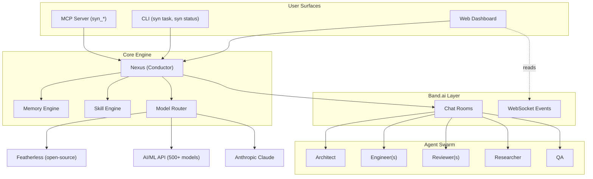
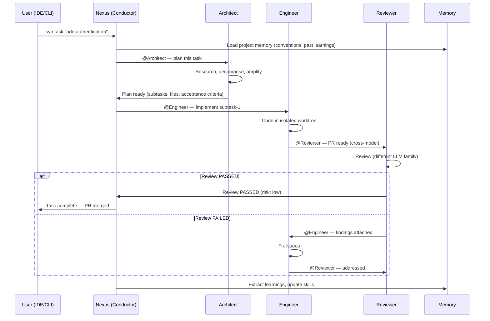
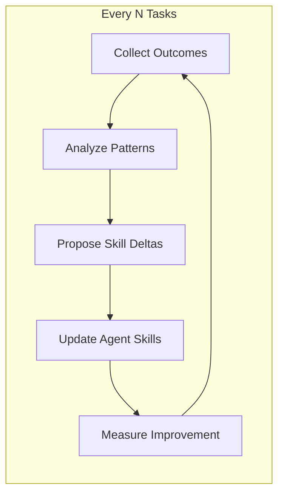
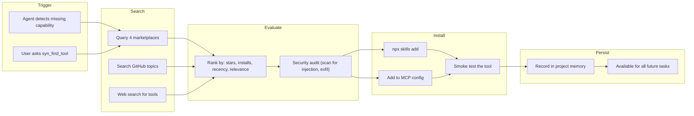

# Syndicate — Strategic Roadmap & Product Specification

## One-Sentence Pitch

**Syndicate is a self-improving multi-agent development swarm where specialized AI agents collaborate through Band rooms, accumulating intelligence across sessions so the 100th task is executed 10x better than the 1st.**

---

## Why This Wins

| Criterion (from judges) | How Syndicate Scores |
|------------------------|---------------------|
| **Application of Technology** (most important) | Band is the CORE coordination layer — all agent-to-agent collaboration flows through rooms with @mention routing |
| **Presentation** | Real-time dashboard shows the collaboration LIVE. Mermaid diagrams, sequence flows, architecture explained. |
| **Business Value** | Real enterprise problem: dev teams waste time on fragmented, stateless AI tools that never learn |
| **Originality** | Self-improving agents + dynamic spawning + compound memory = no other hackathon project does this |

## Prize Targeting

| Prize | Eligibility | How We Qualify |
|-------|-------------|---------------|
| **Main Prize ($3,500/$2,500/$1,500)** | Band as core collaboration layer, 5+ agents, visible workflow | All agent-to-agent goes through Band rooms with @mention routing. Dashboard shows it live. |
| ~~AI/ML API Prize~~ | ~~Multi-model routing~~ | **NOT TARGETING** — dropped from stack |
| ~~Featherless Prize~~ | ~~Open-source models~~ | **NOT TARGETING** — dropped from stack |

Focus is on the **main prize** — maximum quality on the Band collaboration, visible handoffs, and impressive demo.

---

## Anti-Laziness Protocol (Enforced at Every Step)

Every implementation step MUST follow this sequence. Skipping any step = lazy = unacceptable.

```
1. IMPLEMENT — Write the actual code/feature
2. SELF-REVIEW — Re-read what you wrote. Would a staff engineer approve?
3. TEST — Write at least one test proving it works (not "should work" — PROVE it)
4. VERIFY — Run the test. Run the build. Confirm zero errors.
5. DOC SYNC — Update README/AGENTS.md/relevant docs to reflect new state
6. PROVE — Show evidence (test output, screenshot, Band room message) before claiming done
```

### Quality Gates Per Phase

| After Phase | Required Proof |
|-------------|---------------|
| P1 (Foundation) | All 5 agents visible in Band room. Tests passing. README has setup instructions. |
| P2 (Orchestration) | Full task lifecycle recorded in Band room (screenshot/log). Integration tests green. Architecture diagram in docs. |
| P3 (Intelligence) | Memory persists across restarts (test). Self-improvement cycle logged. Different model families confirmed in logs. |
| P4 (Interface) | MCP tool callable from Cursor (screenshot). Dashboard renders live data. E2E test passes. |
| P5 (Polish) | Live URL works. Video recorded. All submission fields filled. |

### Red Flags That Mean "Go Back"

- "It should work" without running it → run it
- Test file exists but is empty or trivial → write a real test
- Docs say one thing, code does another → sync them
- Agent claims "done" but no evidence shown → show evidence
- Skipping error handling → add it
- Copy-paste without understanding → rewrite in context

---

## Architecture (High-Level)



## Task Lifecycle (What Happens When User Says "syn task 'add auth'")



## Self-Improvement Cycle



---

## Strategic Decisions

### What to Build vs. What to Skip

| BUILD (core value) | SKIP (not worth the time) |
|-------------------|--------------------------|
| Multi-agent Band collaboration (the whole point) | Complex auth system (use simple API keys) |
| Real-time dashboard showing agent work | Mobile responsiveness |
| Self-improvement loop with visible evolution | Fancy onboarding wizard |
| MCP server for IDE integration | Payment/billing |
| Cross-model adversarial review | User accounts/multi-tenancy |
| Persistent memory across sessions | Advanced admin panel |
| Dynamic agent spawning | Rate limiting (hackathon, not prod traffic) |
| Beautiful mermaid diagrams in README | Blog/marketing site |

### Where to Invest Maximum Effort

1. **The collaboration must be VISIBLE** — dashboard shows every @mention, handoff, decision in real-time
2. **Cross-model review must be REAL** — genuinely different LLM families catching each other's blind spots
3. **Memory must ACCUMULATE** — show that session 2 is better than session 1
4. **README must be IMPRESSIVE** — diagrams, tables, architecture, one-command setup
5. **Demo video must tell a STORY** — problem → solution → "imagine session 100"

### Where to Accept "Good Enough"

- CLI interface (basic argparse, not a full TUI)
- Error messages (clear but not beautiful)
- Test coverage (critical paths only, not exhaustive)
- Skill evolution (demonstrate the loop, don't need 100 iterations)

---

## Effort Allocation

| Phase | Duration | Effort % | Deliverable |
|-------|----------|----------|-------------|
| Phase 1: Foundation | 4-6 hours | 15% | Copy Manthan, strip domain, register Band agents, get basic agent loop working |
| Phase 2: Orchestration | 8-12 hours | 30% | Full task lifecycle (plan → code → review) with visible Band collaboration |
| Phase 3: Intelligence | 6-8 hours | 20% | Cross-model review (Gemini + Claude), persistent memory, self-improvement cycle |
| Phase 4: Interface | 8-10 hours | 20% | MCP server + real-time dashboard showing live Band room collaboration |
| Phase 5: Polish | 4-6 hours | 15% | Tests, README with diagrams, Vercel deploy, Supabase setup, video, submission |

### Phase 1 Details: Fork and Adapt
1. Copy manthan-main into working directory
2. Strip all billing/dispute domain code
3. Register 5-6 agents on Band platform (using your UUID)
4. Replace Clerk config with YOUR Clerk keys (GitHub + Google + Microsoft)
5. Set up Supabase project (replaces Docker Postgres)
6. Verify: agents can talk to each other through Band rooms
7. Verify: frontend loads with Clerk auth working

### Phase 2 Details: Core Orchestration
1. Implement Nexus (conductor) prompt + Band integration
2. Implement Architect agent (task decomposition)
3. Implement Engineer agent (code generation in isolated workspace)
4. Implement Reviewer agent (cross-model review via Claude)
5. Wire the full lifecycle: task → plan → assign → code → review → complete
6. All communication visible in Band rooms with @mention routing

### Phase 3 Details: Intelligence Layer
1. Cross-model review: Engineer uses Gemini, Reviewer uses Claude
2. Memory engine: protocol state + project memory + agent learning (JSONL + Supabase)
3. Self-improvement: after each task cycle, extract lessons, update agent skills
4. Dynamic spawning: Nexus recruits agents based on task complexity

### Phase 4 Details: Interface Layer
1. MCP server: `syn_task`, `syn_status`, `syn_review`, `syn_init`, `syn_memory`
2. Dashboard: live Band room feed, agent status cards, task pipeline visualization
3. Approval queue: human-in-the-loop for high-risk decisions
4. Trace viewer: see every agent thought, tool call, decision (from Manthan's pattern)

### Phase 5 Details: Ship It
1. README with 5+ mermaid diagrams (architecture, sequence, flow, agent topology, memory)
2. Testing: critical paths only (agent communication, memory, review loop)
3. Deploy: Vercel (frontend) + Railway (backend) + Supabase (DB)
4. Demo video: 5 minutes, telling the compound-intelligence story
5. Submit on lablab.ai with all required fields

---

## Tech Stack Decisions

| Layer | Choice | Rationale |
|-------|--------|-----------|
| **Implementation Base** | Fork `manthan-main`, adapt architecture | Production-grade multi-agent system. Saves weeks of scaffolding. |
| **Agent Coordination** | Band SDK (Python) | Hackathon requirement. @mention routing, WebSocket, rooms. |
| **Agent Brain** | Google ADK patterns (coordinator + parallel specialists) | Proven in Manthan. Fan-out parallelism. Pacer governance. |
| **LLM Providers** | Gemini (free AI Studio) + Anthropic Claude | Gemini for most agents. Claude for adversarial review (different model family). |
| **Frontend** | React 19 + Vite + TypeScript + Tailwind v4 + Zustand | From Manthan. Fast, modern, proven. |
| **Auth** | Clerk (GitHub + Google + Microsoft OAuth) | From Manthan. All 3 providers supported OOTB. |
| **Database** | Supabase (managed PostgreSQL + realtime + edge functions) | Managed. No Docker DB hassle. Built-in realtime subscriptions. |
| **Backend API** | FastAPI + asyncpg | From Manthan. Async-native. WebSocket + SSE + REST in one framework. |
| **Deployment** | Vercel (frontend) + Railway/Cloud Run (backend) + Supabase (DB) | Modern serverless. No infra management. |
| **MCP Server** | Python MCP SDK | Cursor/Claude integration. `syn_*` tools. |
| **Real-time** | SSE (AI streaming) + WebSocket (live updates) | From Manthan. Battle-tested pattern. |
| **Animations** | Motion + GSAP | From Manthan. Premium feel. |
| **Testing** | pytest (backend) + Vitest (frontend) | Fast, modern, adequate coverage. |

### NOT Using (explicitly dropped)

| Dropped | Why |
|---------|-----|
| AI/ML API | User decision — simplifying provider stack |
| Featherless AI | User decision — using Gemini (free) instead |
| Docker-only deployment | Using Vercel + managed services (simpler) |
| Next.js | Using Vite + React (from Manthan — lighter, faster builds) |

---

## Agent Design

| Agent | Cognitive Task | Model | Why |
|-------|---------------|-------|-----|
| **Nexus** | Coordination, routing, state tracking | Gemini 3.1 Pro | Best reasoning, follows complex protocols |
| **Architect** | Planning, decomposition, research | Gemini 3.5 Flash | Fast, good enough for planning |
| **Engineer** | Code implementation | Gemini 3.1 Pro | Strong code generation |
| **Reviewer** | Adversarial code review | Anthropic Claude Sonnet | DIFFERENT model family from Engineer — catches blind spots |
| **Researcher** | Web research, prior art | Gemini 3.1 Flash Lite | Fast, cheap, search synthesis |
| **QA** | Test validation, verification | Gemini 3.1 Flash Lite | Fast verification |

**Key architectural rule from Manthan**: The coordinator (Nexus) uses the strongest model. Specialists use flash models for speed. Cross-model review uses a completely different provider (Gemini writes, Claude reviews).

---

## Implementation Strategy: Fork Manthan, Adapt for Band

### What We Keep from Manthan (saves weeks)
- 3-layer monorepo structure (`agent/` + `api/` + `ui/`)
- FastAPI backend with asyncpg
- React 19 + Vite + Tailwind v4 frontend
- Clerk auth (GitHub + Google + Microsoft)
- SSE streaming for AI responses
- Event-driven agent architecture (brain yields events)
- Zustand state management
- OpenTelemetry observability
- GSAP/Motion animations for polish
- Deterministic action execution pattern (LLM proposes, code executes)

### What We Replace/Add
- Manthan's Google ADK agents → Band SDK agents (coordinated through Band rooms)
- Manthan's Coral SQL data plane → Git workspace + code analysis tools
- Manthan's billing dispute domain → Software development lifecycle domain
- Manthan's triage/investigator/advisor → Nexus/Architect/Engineer/Reviewer/Researcher/QA
- ADD: MCP server for IDE integration
- ADD: Self-improvement loop (SkillOpt pattern from skill-forge)
- ADD: Persistent project memory that compounds
- ADD: Dynamic agent spawning via Band peer discovery
- ADD: Live collaboration dashboard (Band room visualization)

### What We Delete from Manthan
- All billing/dispute domain logic
- Stripe integration
- Coral data plane
- HubSpot/Intercom/Datadog adapters
- Policy engine (replace with code review severity gates)

---

## Memory Architecture

Three layers, each with clear purpose:

| Layer | Scope | Persists | Purpose |
|-------|-------|----------|---------|
| **Protocol State** | Per-task | Until task complete | Track where we are in the workflow (like Codeband envelopes) |
| **Project Memory** | Per-project | Forever | Conventions, gotchas, architecture decisions for THIS codebase |
| **Agent Learning** | Per-agent-role, cross-project | Forever | What patterns work, what fails, how to improve (drives skill evolution) |

---

## Dashboard Design (What Judges See — THE Product Surface)

> "Selling a product right is SO IMPORTANT." The dashboard IS the product. Not a data dump. A narrative.

### Design Language
- **Aesthetic**: Linear meets Dimension — dark command deck, one accent color, glassmorphic surfaces
- **Typography**: Inter Variable (UI) + Berkeley Mono (code/IDs), whisper-weight headlines
- **Colors**: Near-black canvas (#08090a), cool gray scale, single accent (indigo or acid lime)
- **Surfaces**: Glassmorphism (backdrop-blur + translucency), 1px hairline borders, no heavy shadows
- **Shapes**: Pill-shaped interactions (9999px radius), 12px cards, 6px inputs

### Animation (Framer Motion + GSAP — MANDATORY everywhere)
- Page transitions: fade + Y translate (300ms, spring)
- Cards: scale from 0.96 + opacity (250ms, spring)
- Agent status: breathing pulse animation (infinite, 2s)
- Messages: character-by-character streaming reveal
- Task pipeline: flow indicators with spring physics
- Loading: skeleton shimmer, never blank space
- Scroll reveals: staggered fade-in with IntersectionObserver

### Micro-Interactions
- Every button: hover scale (1.02), press scale (0.97)
- Every card: hover lift + border glow
- Focus rings: animated expand outward
- Number counters: animate from 0 when entering viewport
- Agent avatars: subtle idle breathing animation

### Sound Design (subtle, mutable, satisfying)
- Task submitted: soft whoosh
- Agent joined room: subtle ping
- Review passed: satisfying ding
- Task complete: rising tone sequence
- Approval needed: gentle chime

### Pages

| Page | Purpose | Key Elements | Animation Focus |
|------|---------|-------------|-----------------|
| **Live Room** | Watch agents collaborate | Message feed with streaming text, agent avatars with status pulse | Character reveal, message slide-in, avatar breathing |
| **Task Pipeline** | See progress through stages | Kanban with spring-physics card movement | Drag-drop, state transitions, progress bars with overshoot |
| **Agent Status** | Who's doing what | Cards with role, model, current task | Pulse animation, status color transitions |
| **Memory/Evolution** | System learning over time | Timeline of lessons, skill deltas, metrics | Number counters, graph drawing animation, growth visualization |
| **Cost Tracker** | Token usage per model | Animated bar charts | Bar grow-in, hover detail reveal |
| **Approval Queue** | Human-in-the-loop | Cards with weight and urgency | Slide-in from edge, gentle pulse for pending items |

Design inspiration: Linear (clean density), Vercel (developer dashboard), Dimension (glassmorphic atmosphere), Dala (cosmic void + accent punch).

---

## MCP Tools (What Users Call from Cursor)

| Tool | Description | Returns |
|------|-------------|---------|
| `syn_init` | Initialize Syndicate for current project (creates memory context) | Confirmation + project profile |
| `syn_task` | Send a development task to the swarm | Task ID + live status URL |
| `syn_status` | Check current swarm state | Active agents, current task, progress |
| `syn_review` | Request review of staged/committed changes | Review findings (streaming) |
| `syn_research` | Spawn a researcher for a question | Synthesized answer with sources |
| `syn_memory` | Query or write project memory | Relevant memories for context |
| `syn_approve` | Approve a pending human-in-the-loop decision | Confirmation, triggers next step |
| `syn_evolve` | Trigger self-improvement cycle | Report of what changed and why |
| `syn_find_tool` | Search MCP/skill marketplaces for a capability | Ranked results with install commands |
| `syn_install_tool` | Install a discovered skill/MCP into the swarm | Confirmation + capability added |

---

## Dynamic Tool Discovery (Self-Expanding Capability)

Agents can autonomously expand the swarm's capabilities by searching and installing tools from the ecosystem:

### Marketplace Sources (21,600+ skills, 12,500+ MCP servers)

| Source | What It Has | Search Method |
|--------|-------------|---------------|
| [mcpmarket.com](https://mcpmarket.com) | MCP servers for any integration | Web scrape / API |
| [skillsllm.com](https://skillsllm.com) | 3,040+ skills, categorized | Web scrape / API |
| [claudeskills.info](https://claudeskills.info) | 658+ curated Claude skills | Web scrape |
| [claudemarketplaces.com](https://claudemarketplaces.com) | 21,600+ skills, 12,500+ MCP servers | Web scrape |
| GitHub Topics | `cursor-skills`, `mcp-server` repos | gh API search |
| Web Search | Exa / Bright Data SERP for novel tools | Semantic search |

### Discovery Flow



### Example Scenarios

| Task | Missing Capability | Discovery Result |
|------|-------------------|-----------------|
| "Add Stripe payments" | No Stripe MCP | Finds stripe MCP server on mcpmarket.com → installs |
| "Write E2E tests" | No Playwright skill | Finds adding-e2e-tests on skillsllm.com → installs |
| "Deploy to Vercel" | No Vercel tooling | Finds Vercel plugin on claudemarketplaces.com → installs |
| "Set up monitoring" | No observability MCP | Finds Datadog/Sentry MCP → installs |

---

## Delivery Milestones

### Milestone 1: "Agents Are Talking" (Phase 1 complete)
- 5 agents registered on Band platform
- Nexus can discover, invite, and @mention other agents
- Basic message exchange working (proof: Band room shows conversation)

### Milestone 2: "Full Task Lifecycle" (Phase 2 complete)
- User sends task → Architect plans → Engineer codes → Reviewer reviews → Complete
- Visible handoffs in Band room
- Cross-model review working (different LLM families)

### Milestone 3: "Intelligence Layer" (Phase 3 complete)
- Multiple model providers in use (Featherless + AI/ML API)
- Memory persists between tasks
- One demonstration of self-improvement (show before/after)

### Milestone 4: "Interface Layer" (Phase 4 complete)
- MCP server callable from Cursor
- Dashboard showing live Band room activity
- Approval queue for human-in-the-loop

### Milestone 5: "Ship It" (Phase 5 complete)
- README with 5+ mermaid diagrams
- docker-compose one-command setup
- 5-minute demo video recorded
- Deployed live at a URL
- Submitted on lablab.ai

---

## Risk Register

| Risk | Impact | Mitigation |
|------|--------|-----------|
| Band free tier hits 10-agent limit | High | Use 5-7 agents max. Reuse agents across tasks. |
| Featherless concurrency bottleneck (4 channels) | Medium | Small models for simple tasks. Queue when busy. |
| LLM reliability (API timeouts, bad responses) | Medium | Fallback chain: Featherless → AI/ML API → local cache. Retry with backoff. |
| Dashboard takes too long to build | Medium | Start with minimal viable: message feed + agent status. Add charts later. |
| Demo doesn't show visible collaboration | Critical | Test the full flow repeatedly. Record backup video early. |
| Self-improvement loop is hard to demonstrate | Medium | Pre-seed one "before" and show "after" in the demo. Log the evolution. |

---

## What Makes This a Startup (Beyond Hackathon)

| Hackathon Version | Startup Version |
|-------------------|-----------------|
| 5-7 agents, single project | Unlimited agents, multi-project |
| JSONL + Supabase memory | Full vector DB + semantic retrieval |
| Single user (Clerk) | Team collaboration with shared agents |
| Basic self-improvement | ML-driven skill optimization with RL signals |
| Free Band tier | Band Enterprise (cross-org agents) |
| Demo dashboard | Production dashboard with billing |
| One workflow (code task) | Many workflows (debug, refactor, deploy, review PR, research, onboard) |
| Gemini + Claude | Any model provider (plug-and-play) |
| Vercel deploy | Self-hosted option + Vercel |

## Manthan Adaptation Map

| Manthan Component | Syndicate Equivalent |
|-------------------|---------------------|
| Billing dispute domain | Software development lifecycle |
| Triage agent | Nexus (conductor) — receives tasks, routes |
| Investigator coordinator | Nexus — orchestrates specialists |
| 5 parallel specialists | Architect + Engineer + Reviewer + Researcher + QA |
| Coral SQL data plane | Git workspace + code analysis + file system tools |
| Policy engine (amount gates) | Risk-based review gates (auto-merge low / approve high) |
| Deterministic actor | Merge executor (git operations post-approval) |
| Advisor agent | Memory/help agent (answers questions about project state) |
| Case → Events → Brief | Task → Events → Completion |
| Stripe webhooks (trigger) | MCP tool call / CLI command / GitHub webhook (trigger) |
| Agent Cards (A2A) | Band agent descriptions + peer discovery |
| Clerk auth | Clerk auth (keep as-is, add GitHub + Google + Microsoft) |
| SSE streaming | SSE streaming (keep as-is) |
| Traces page | Agent collaboration visualization page |
| Controls page | Approval queue + agent management |
