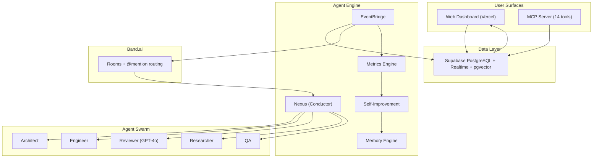
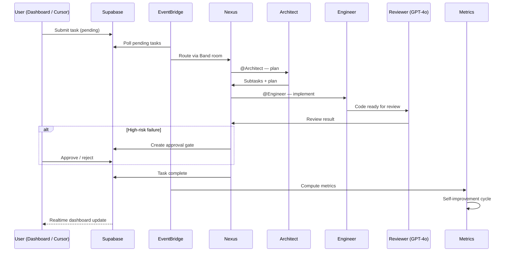
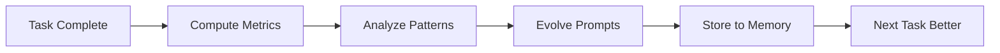

<p align="center">
  <h1 align="center">Syndicate</h1>
  <p align="center"><strong>Compound intelligence for developers</strong> — a self-improving multi-agent swarm that grows with you.</p>
</p>

<p align="center">
  <a href="https://syndicate-ui-five.vercel.app"></a>
  
  
  
  
  
  
</p>

<p align="center">
  <a href="https://syndicate-ui-five.vercel.app">Live Demo</a> ·
  <a href="docs/ARCHITECTURE.md">Architecture</a> ·
  <a href="docs/DEMO_SCRIPT.md">Demo Script</a> ·
  <a href="CHANGELOG.md">Changelog</a>
</p>

---

## Overview

Syndicate is a multi-agent developer orchestration platform where **six specialized AI agents** collaborate through [Band](https://band.ai) rooms to plan, implement, review, and validate software work. Tasks submitted from the web dashboard or Cursor IDE flow through a persistent event bridge into Band, where agents coordinate via @mention routing and write structured events back to Supabase in real time.

Unlike stateless chat tools, Syndicate **accumulates intelligence across sessions**: conventions, review outcomes, and workflow patterns are stored in semantic memory and fed back into evolving agent prompts.

### What makes it different

| Capability | Description |
|------------|-------------|
| **Visible collaboration** | Every agent handoff is logged as an immutable event — plan, code, review, approval, completion |
| **Cross-model review** | Gemini writes; Azure OpenAI GPT-4o reviews — different model families catch different blind spots |
| **Compound memory** | Three-layer memory (protocol, project, agent) with pgvector semantic search |
| **Self-improvement loop** | Metrics and SkillOpt-style prompt evolution after each completed task |
| **Human-in-the-loop** | High-risk review failures create approval gates resumable from dashboard or IDE |
| **IDE-native** | 14 MCP tools expose the full swarm workflow from Cursor |

---

## Architecture



**Data flow:** Dashboard or MCP inserts a task → EventBridge polls Supabase → routes to Nexus via Band REST → agents collaborate in-room → bridge classifies responses into typed events → on completion, metrics and self-improvement run → dashboard updates via Supabase Realtime.

See [docs/ARCHITECTURE.md](docs/ARCHITECTURE.md) for component-level detail.

---

## Task Lifecycle



**Task statuses:** `pending` → `planning` → `in_progress` → `reviewing` → `awaiting_approval` (optional) → `complete` / `failed`

---

## Agent Roster

| Agent | Role | Model | Responsibility |
|-------|------|-------|----------------|
| **Nexus** | Conductor | Gemini 2.5 Flash | Routes tasks, discovers peers, tracks protocol state |
| **Architect** | Planner | Gemini 2.5 Flash | Decomposes work into structured subtasks |
| **Engineer** | Coder | Gemini 2.5 Flash | Implements assignments from the plan |
| **Reviewer** | Quality gate | Azure OpenAI GPT-4o | Adversarial cross-model review |
| **Researcher** | Discovery | Gemini 2.5 Flash | Web research, tool and skill discovery |
| **QA** | Validator | Gemini 2.5 Flash | Testing and verification |

All agents use the Band SDK with LangGraph adapters. Communication is room-based with @mention routing.

---

## Tech Stack

| Layer | Technology | Purpose |
|-------|------------|---------|
| **Coordination** | [Band.ai](https://band.ai) | Rooms, @mention routing, WebSocket |
| **Primary LLM** | Google Gemini 2.5 Flash | Five specialist agents |
| **Adversarial LLM** | Azure OpenAI GPT-4o | Reviewer — different model family |
| **Embeddings** | Google text-embedding-004 | 768-dim vectors for semantic memory |
| **Frontend** | React 19, Vite 8, TypeScript, Tailwind v4, Zustand, Three.js, Framer Motion | Dashboard and live collaboration UI |
| **Auth** | [Clerk](https://clerk.com) | GitHub, Google, Microsoft OAuth |
| **Database** | [Supabase](https://supabase.com) | PostgreSQL, pgvector, Realtime, RLS |
| **MCP** | Python (JSON-RPC over stdio) | Cursor IDE integration |
| **Deployment** | Vercel (UI), Railway / Render (agents), Supabase (DB) | Production stack |

The dashboard reads and writes Supabase directly — no separate backend API is required for the demo stack.

---

## Quick Start

### Prerequisites

- Python 3.12+
- Node.js 20+
- API keys: Google AI Studio (`GOOGLE_API_KEY`), Azure OpenAI, Supabase, Band agent config

### 1. Clone and configure

```bash
git clone https://github.com/Adit-Jain-srm/Vibe-Syndicate.git
cd Vibe-Syndicate
cp .env.example .env
# Fill: GOOGLE_API_KEY, AZURE_OPENAI_*, SUPABASE_URL, SUPABASE_KEY, BAND_ROOM_ID, NEXUS_API_KEY
```

### 2. Start the dashboard

```bash
cd syndicate-ui
npm install
npm run dev
# → http://localhost:5173
```

Set `VITE_CLERK_PUBLISHABLE_KEY` and Supabase anon URL/key in `syndicate-ui/.env` for auth and realtime.

### 3. Start the agent swarm

```bash
cd syndicate-agent
pip install -e .
python -m syndicate_agent.main
```

The swarm connects to Band, starts the EventBridge task poller, and exposes a health endpoint on `PORT` (used by Railway/Render).

### 4. Connect Cursor (MCP)

Add to `.cursor/mcp.json`:

```json
{
  "mcpServers": {
    "syndicate": {
      "command": "python",
      "args": ["syndicate-mcp/server.py"]
    }
  }
}
```

Root `.env` credentials are loaded automatically by the MCP server.

---

## MCP Tools

Fourteen tools callable from Cursor:

| Tool | Description |
|------|-------------|
| `syn_init` | Initialize Syndicate for a project |
| `syn_task` | Submit a task to the swarm (writes to Supabase, bridge routes to Band) |
| `syn_status` | Active agents, recent tasks, pending approvals |
| `syn_review` | Request adversarial cross-model code review |
| `syn_memory` | Query or store persistent project memory |
| `syn_find_tool` | Search GitHub and skill marketplaces |
| `syn_install_skill` | Install a skill from a GitHub repository |
| `syn_list_skills` | List installed skills (`.cursor/skills`, `.agents/skills`) |
| `syn_skill_info` | Read a skill's `SKILL.md` |
| `syn_approve` | Approve or reject a human-in-the-loop decision |
| `syn_events` | Event timeline for a task |
| `syn_cancel` | Cancel a running or pending task |
| `syn_watch` | Live task state plus events since a timestamp |
| `syn_explain` | Ask an agent to explain a decision or event |

---

## Dashboard

**Live:** [syndicate-ui-five.vercel.app](https://syndicate-ui-five.vercel.app)

| Route | Page | Description |
|-------|------|-------------|
| `/` | Landing | Product overview and agent roster |
| `/app` | Dashboard | Task submission, swarm status, progress indicators |
| `/pipeline` | Pipeline | Signal flow: Input → Plan → Code → Review → Output |
| `/live` | Live Room | Real-time event stream across all tasks |
| `/live/:taskId` | Live Room | Task-scoped event feed |
| `/tasks` | Tasks | Kanban pipeline view |
| `/tasks/:id` | Task Detail | Full task conversation and metadata |
| `/agents` | Agents | Roster with live status badges |
| `/metrics` | Metrics | KPIs, improvement trends, review scores |
| `/memory` | Memory | Semantic memory browser with category filter |
| `/approvals` | Approvals | Human-in-the-loop queue with risk levels |
| `/traces` | Traces | Event trace explorer |
| `/skills` | Skills | Installed agent skills overview |
| `/replay/:taskId` | Replay | Step-through task replay |
| `/controls` | Controls | Swarm control surface |
| `/settings` | Settings | Theme (dark/light), preferences |
| `/docs` | Docs | In-app setup and MCP reference |

**UI highlights:** dark/light theme, Web Audio sound design, 3D agent constellation, skeleton loading states, Supabase Realtime on all tables, command palette navigation.

---

## Database Schema

| Table | Purpose |
|-------|---------|
| `agents` | Six agent records with status (`idle` / `active`) |
| `tasks` | Task lifecycle with UUID primary keys |
| `events` | Immutable event log — every agent action |
| `memory` | Persistent learnings with pgvector embeddings |
| `task_metrics` | Per-task KPIs: first-pass rate, iterations, duration, review score |
| `approvals` | Human-in-the-loop decisions with risk levels |

All tables have RLS policies and Supabase Realtime enabled. Migrations live in `syndicate-agent/migrations/` and `syndicate-api/migrations/`.

---

## Self-Improvement

After each task completion:

1. **MetricsEngine** computes first-pass rate, iteration count, time-to-complete, and review score
2. **SelfImprovementEngine** detects recurring patterns from agent learnings
3. **Skill evolution** appends validated patterns to agent prompt documents
4. **Memory** stores the learning with a pgvector embedding for future semantic retrieval



---

## Project Structure

```
Vibe-Syndicate/
├── syndicate-agent/           # Agent brain (Band SDK + LLM + bridge)
│   ├── src/syndicate_agent/
│   │   ├── main.py            # Swarm runner, health server, cloud config
│   │   ├── bridge.py          # Band ↔ Supabase EventBridge
│   │   ├── orchestrator.py    # Task lifecycle + approval gates
│   │   ├── metrics.py         # Performance computation
│   │   ├── memory.py          # 3-layer memory + pgvector search
│   │   ├── self_improve.py    # SkillOpt evolution loop
│   │   └── prompts/           # Per-agent prompt documents
│   ├── migrations/            # SQL (metrics, pgvector, approvals)
│   ├── railway.toml           # Railway deployment config
│   └── nixpacks.toml          # Nixpacks build config
├── syndicate-ui/              # React 19 dashboard (Vercel)
│   ├── src/pages/             # Dashboard, Live, Pipeline, Metrics, …
│   ├── src/components/        # UI, 3D constellation, HUD overlays
│   ├── src/stores/            # Zustand + Supabase Realtime
│   └── src/lib/               # API client, theme, sounds
├── syndicate-mcp/             # MCP server (14 tools)
│   └── server.py
├── syndicate-api/             # Optional FastAPI layer + shared migrations
├── tests/                     # 73 pytest tests (unit + integration + E2E)
├── docs/                      # Architecture, demo script
├── memory/                    # Local JSONL memory (protocol, project, agent)
├── render.yaml                # Render Blueprint (free web service)
├── vercel.json                # Vercel monorepo config (syndicate-ui/)
├── AGENTS.md                  # Persistent project memory for agents
└── CHANGELOG.md
```

---

## Deployment

| Service | Platform | Notes |
|---------|----------|-------|
| **Frontend** | [Vercel](https://syndicate-ui-five.vercel.app) | Auto-deploys from `main`; root `vercel.json` points to `syndicate-ui/` |
| **Database** | Supabase | Managed PostgreSQL with Realtime and pgvector |
| **Agent swarm** | Railway or Render | Long-running process; health check at `/` |
| **MCP** | Local | Loaded by Cursor from `.cursor/mcp.json` |

### Cloud agent deployment

**Railway** (root directory: `syndicate-agent/`):

```bash
# Required env vars in Railway dashboard:
# AGENT_CONFIG_YAML_B64, GOOGLE_API_KEY, SUPABASE_URL, SUPABASE_KEY,
# AZURE_OPENAI_ENDPOINT, AZURE_OPENAI_API_KEY, AZURE_OPENAI_DEPLOYMENT
```

Uses `railway.toml` — editable install + `PYTHONPATH=src` start command.

**Render** (Blueprint: `render.yaml` at repo root):

Deploy as a free web service with `healthCheckPath: /`. Set `AGENT_CONFIG_YAML_B64` and API keys in the Render dashboard. Use `scripts/deploy-render.ps1` to generate an env bundle from local `.env`.

> **Note:** Run only one swarm instance at a time (local **or** cloud) to avoid duplicate agents on Band.

---

## Testing

```bash
# Full suite — 73 tests
python -m pytest tests/ -v

# By domain
python -m pytest tests/test_band.py tests/test_metrics.py tests/test_mcp.py -v   # bridge, metrics, MCP
python -m pytest tests/test_supabase.py -v                                        # Supabase CRUD + RLS
python -m pytest tests/test_e2e.py tests/test_e2e_p1.py tests/test_e2e_p2.py -v   # lifecycle E2E

# Frontend typecheck
cd syndicate-ui && npm run typecheck
```

---

## Documentation

| Document | Description |
|----------|-------------|
| [docs/ARCHITECTURE.md](docs/ARCHITECTURE.md) | System design, component map, design decisions |
| [docs/BAND-SDK-REFERENCE.md](docs/BAND-SDK-REFERENCE.md) | Band SDK tool names and patterns |
| [docs/DEMO_SCRIPT.md](docs/DEMO_SCRIPT.md) | 5-minute demo walkthrough |
| [AGENTS.md](AGENTS.md) | Project identity, ADRs, session log |
| [CHANGELOG.md](CHANGELOG.md) | Version history |

In-app docs are also available at `/docs` in the dashboard.

---

## Author

**Adit Jain** — [GitHub](https://github.com/Adit-Jain-srm)

## License

MIT
