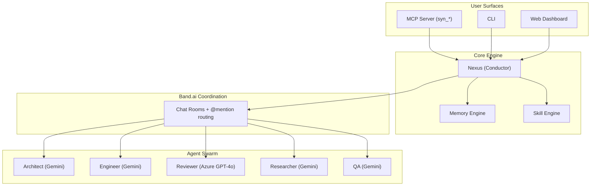
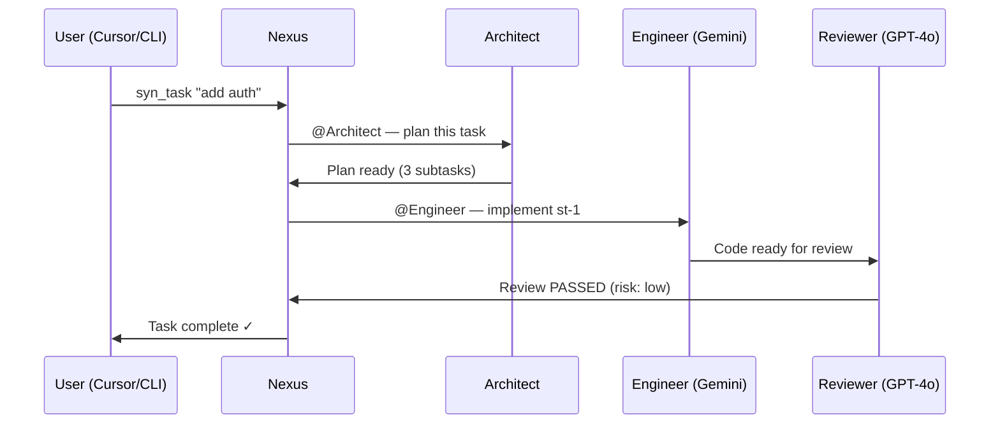
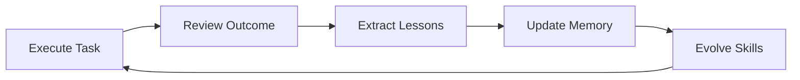
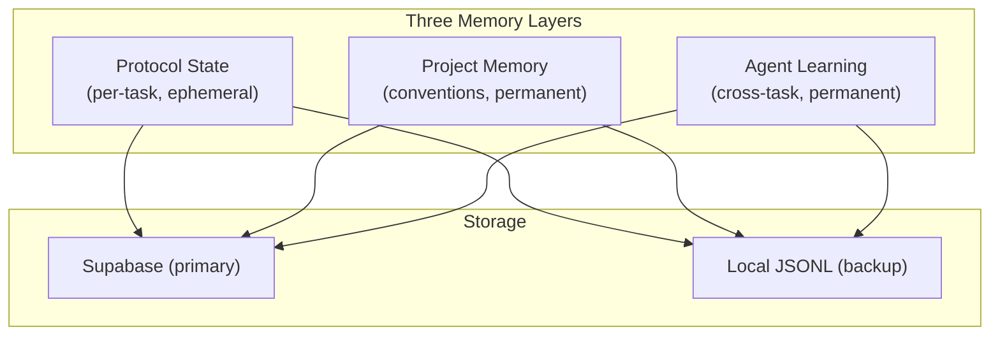

<p align="center">
  <h1 align="center">Syndicate</h1>
  <p align="center"><strong>Compound intelligence for developers</strong> — a self-improving multi-agent swarm that grows with you.</p>
</p>

<p align="center">
  
  
  
  
  
</p>

<p align="center">
  <strong>Band of Agents Hackathon</strong> · June 12–19, 2026 · <a href="https://lablab.ai/ai-hackathons/band-of-agents-hackathon">lablab.ai</a>
</p>

---

## What is Syndicate?

Syndicate is a multi-agent developer orchestration platform where **6 specialized AI agents** collaborate through [Band](https://band.ai) rooms to deliver complete software workflows — from project initialization through deployment.

Unlike existing AI tools that start fresh every session, Syndicate **accumulates intelligence**: every task makes it better at the next one.



## Task Lifecycle



## Self-Improvement Loop



## Memory Architecture



## Why Syndicate?

| Problem | Syndicate Solution |
|---------|-------------------|
| AI tools are stateless — context lost every session | Persistent memory compounds across tasks and sessions |
| Single models have blind spots | Cross-model adversarial review (Gemini writes, GPT-4o reviews) |
| Planning, coding, reviewing are fragmented | Unified multi-agent lifecycle with visible handoffs |
| AI never learns your codebase | Project memory stores conventions, gotchas, architecture decisions |
| No visibility into AI collaboration | Real-time dashboard shows agent-to-agent work live |

## Agent Roster

| Agent | Role | Model | What It Does |
|-------|------|-------|-------------|
| **Nexus** | Conductor | Gemini 2.5 Flash | Routes tasks, discovers peers, tracks protocol state |
| **Architect** | Planner | Gemini 2.5 Flash | Decomposes tasks into structured subtasks |
| **Engineer** | Coder | Gemini 2.5 Flash | Implements code in isolated workspaces |
| **Reviewer** | Quality Gate | Azure OpenAI GPT-4o | Adversarial cross-model code review |
| **Researcher** | Discovery | Gemini 2.5 Flash | Web research, tool discovery, prior art |
| **QA** | Validator | Gemini 2.5 Flash | Testing and verification |

All agents communicate through **Band rooms** with @mention routing. Cross-model review is mandatory — the reviewer always runs on a different model family than the engineer.

## Quick Start

```bash
# Prerequisites: Python 3.12+, Node 20+, uv
git clone https://github.com/Adit-Jain-srm/Vibe-Syndicate.git
cd Vibe-Syndicate

# Environment
cp .env.example .env
# Fill in: GOOGLE_API_KEY, AZURE_OPENAI_API_KEY, CLERK keys, SUPABASE keys

# Backend
cd syndicate-api && uv sync && uv run uvicorn syndicate_api.main:app --reload --port 8000

# Frontend (new terminal)
cd syndicate-ui && npm install && npm run dev

# Agent swarm (new terminal)  
cd syndicate-agent && uv sync && python -m syndicate_agent.main
```

## Testing

```bash
pip install pytest pytest-asyncio httpx pyyaml

# Full P1 verification (14 tests)
python -m pytest tests/test_e2e_p1.py -v
```

Verifies: Band agents (6/6), Supabase tables (4), Gemini API, Azure OpenAI, project structure integrity.

## Tech Stack

| Layer | Technology |
|-------|-----------|
| **Agent Coordination** | [Band.ai](https://band.ai) — rooms, @mention routing, WebSocket, peer discovery |
| **LLM (Primary)** | Google Gemini 2.5 Flash — coordinator + specialists |
| **LLM (Adversarial)** | Azure OpenAI GPT-4o — cross-model code review |
| **Frontend** | React 19 + Vite 8 + TypeScript 6 + Tailwind v4 + Zustand |
| **Auth** | [Clerk](https://clerk.com) — GitHub + Google + Microsoft OAuth |
| **Backend** | FastAPI + asyncpg + Pydantic v2 |
| **Database** | [Supabase](https://supabase.com) (PostgreSQL) |
| **MCP** | Python MCP server for Cursor/Claude integration |
| **Deployment** | Vercel (frontend) + Railway (backend) + Supabase (DB) |

## MCP Tools (Cursor Integration)

Install: Add to `.cursor/mcp.json` and the tools appear in Cursor automatically.

| Tool | What It Does |
|------|-------------|
| `syn_init` | Initialize Syndicate for a project |
| `syn_task` | Send a development task to the swarm |
| `syn_status` | Check agent status and active tasks |
| `syn_review` | Request adversarial cross-model code review |
| `syn_memory` | Query or store persistent project memory |
| `syn_find_tool` | Search marketplaces for skills/MCPs |

## Project Structure

```
Vibe-Syndicate/
├── syndicate-agent/           # Agent brain
│   ├── src/syndicate_agent/
│   │   ├── main.py            # Swarm runner (all agents concurrently)
│   │   ├── config.py          # Environment config
│   │   ├── types.py           # Typed vocabulary (Task, Event, Subtask, etc.)
│   │   └── prompts/           # Per-role prompt documents
│   │       ├── nexus.md       # Conductor protocol
│   │       ├── architect.md   # Planning rules
│   │       ├── engineer.md    # Implementation rules
│   │       └── reviewer.md    # Review protocol
│   └── pyproject.toml
├── syndicate-api/             # Backend API
│   ├── src/syndicate_api/
│   │   ├── main.py            # FastAPI app
│   │   ├── api/               # Routes (health, tasks, agents, events, memory)
│   │   └── middleware/        # Clerk JWT auth
│   ├── migrations/            # Supabase SQL
│   └── pyproject.toml
├── syndicate-ui/              # Frontend dashboard
│   ├── src/
│   │   ├── pages/             # Dashboard, LiveRoom, Agents, Tasks, Memory
│   │   ├── components/        # UI primitives + auth
│   │   └── globals.css        # Design tokens (Linear-inspired dark mode)
│   └── package.json
├── tests/                     # E2E verification tests
├── docs/                      # Architecture docs, hackathon resources
├── AGENTS.md                  # Persistent project memory & decisions
└── .env.example               # All environment variables documented
```

## Hackathon

**Band of Agents Hackathon** — [lablab.ai](https://lablab.ai/ai-hackathons/band-of-agents-hackathon)

- **Track**: Multi-Agent Software Development
- **Core requirement**: 3+ agents collaborating through Band (we have 6)
- **Band usage**: CORE coordination layer — all agent-to-agent communication flows through Band rooms
- **Differentiator**: Self-improving agents + cross-model adversarial review + persistent compound memory

## Status

| Phase | Status |
|-------|--------|
| P1: Foundation | ✓ Complete — 3-layer monorepo, Band agents, Supabase, Clerk |
| P2: Orchestration | ✓ Complete — Nexus conductor, task lifecycle, SSE streaming |
| P3: Intelligence | ✓ Complete — Memory engine, self-improvement, tool discovery |
| P4: Interface | ✓ Complete — MCP server (6 tools), real-time dashboard (5 pages) |
| P5: Polish | In Progress — deployment, video, submission |

## Author

**Adit Jain** — [@aditjain2005](https://github.com/Adit-Jain-srm)

## License

MIT
