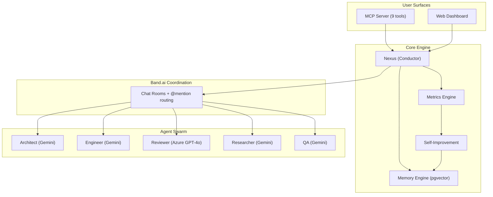
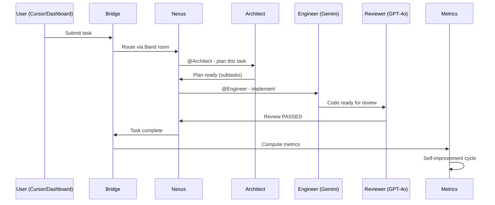
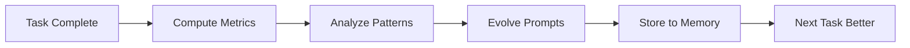

<p align="center">
  <h1 align="center">Syndicate</h1>
  <p align="center"><strong>Compound intelligence for developers</strong> - a self-improving multi-agent swarm that grows with you.</p>
</p>

<p align="center">
  
  
  
  
  
</p>

<p align="center">
  <a href="https://syndicate-ui-five.vercel.app">Live Demo</a> -
  <a href="https://lablab.ai/ai-hackathons/band-of-agents-hackathon">Hackathon</a> -
  <a href="docs/DEMO_SCRIPT.md">Demo Script</a>
</p>

---

## What is Syndicate?

Syndicate is a multi-agent developer orchestration platform where **6 specialized AI agents** collaborate through [Band](https://band.ai) rooms to deliver complete software workflows.

Unlike existing AI tools that start fresh every session, Syndicate **accumulates intelligence**: every task makes it better at the next one.



## Task Lifecycle



## Agent Roster

| Agent | Role | Model | What It Does |
|-------|------|-------|-------------|
| **Nexus** | Conductor | Gemini 2.5 Flash | Routes tasks, discovers peers, tracks state |
| **Architect** | Planner | Gemini 2.5 Flash | Decomposes tasks into structured subtasks |
| **Engineer** | Coder | Gemini 2.5 Flash | Implements code from assignments |
| **Reviewer** | Quality Gate | Azure OpenAI GPT-4o | Adversarial cross-model review |
| **Researcher** | Discovery | Gemini 2.5 Flash | Web research, tool finding |
| **QA** | Validator | Gemini 2.5 Flash | Testing and verification |

All agents communicate through **Band rooms** with @mention routing. The reviewer always runs on a **different model family** than the engineer (Gemini writes, GPT-4o reviews).

## Quick Start

```bash
# Prerequisites: Python 3.12+, Node 20+
git clone https://github.com/Adit-Jain-srm/Vibe-Syndicate.git
cd Vibe-Syndicate

# Environment
cp .env.example .env
# Fill: GOOGLE_API_KEY, AZURE_OPENAI_*, SUPABASE_URL, SUPABASE_KEY

# Frontend
cd syndicate-ui && npm install && npm run dev

# Agent swarm (new terminal)
python -m syndicate_agent.main
```

## MCP Tools (Cursor IDE Integration)

The MCP server exposes 9 tools callable from Cursor. Configure in `.cursor/mcp.json`:

```json
{
  "mcpServers": {
    "syndicate": {
      "command": "python",
      "args": ["syndicate-mcp/server.py"]
    }
  }
}
```

| Tool | Description |
|------|-------------|
| `syn_init` | Initialize Syndicate for a project (returns agent count + skill count) |
| `syn_task` | Send a task to the swarm (creates in Supabase, bridge picks it up) |
| `syn_status` | Check agents, recent tasks, pending approvals |
| `syn_review` | Request adversarial cross-model code review |
| `syn_memory` | Query or store persistent project memory (with category filter) |
| `syn_find_tool` | Search GitHub for cursor-skills repos |
| `syn_install_skill` | Install a skill from GitHub into the project |
| `syn_list_skills` | List all installed skills (77 detected) |
| `syn_skill_info` | Read SKILL.md content of any installed skill |

## Tech Stack

| Layer | Technology |
|-------|-----------|
| **Agent Coordination** | [Band.ai](https://band.ai) - rooms, @mention routing, WebSocket |
| **LLM (Primary)** | Google Gemini 2.5 Flash - 5 agents |
| **LLM (Adversarial)** | Azure OpenAI GPT-4o - cross-model review |
| **Frontend** | React 19 + Vite 8 + TypeScript + Tailwind v4 + Zustand + Three.js |
| **Auth** | [Clerk](https://clerk.com) - GitHub + Google + Microsoft OAuth |
| **Database** | [Supabase](https://supabase.com) (PostgreSQL + pgvector + Realtime) |
| **MCP** | Python MCP server (9 tools, JSON-RPC over stdio) |
| **Deployment** | Vercel (frontend) + Supabase (DB) |

## Database Schema

| Table | Purpose |
|-------|---------|
| `agents` | 6 agent records with status (idle/active) |
| `tasks` | Task lifecycle (pending -> planning -> in_progress -> reviewing -> complete) |
| `events` | Immutable event log (every agent action tracked) |
| `memory` | Persistent learnings with pgvector embeddings |
| `task_metrics` | Quantified performance (first_pass_rate, iterations, time, score) |
| `approvals` | Human-in-the-loop decisions (pending/approved/rejected) |

All tables have RLS policies (anon read/write) and Supabase Realtime enabled.

## Dashboard Pages

| Route | Page | Description |
|-------|------|-------------|
| `/` | Landing | Product overview, agent roster, features |
| `/app` | Dashboard | Task submission, agent stats, swarm status |
| `/pipeline` | Pipeline | Signal-flow: Input -> Plan -> Code -> Review -> Output |
| `/live` | Live Room | Real-time event stream |
| `/agents` | Agents | Roster with status badges |
| `/tasks` | Tasks | Kanban pipeline view |
| `/metrics` | Metrics | KPIs, improvement trends, agent activity |
| `/memory` | Memory | Store/query learnings with category filter |
| `/approvals` | Approvals | HITL decisions with risk levels |

## Project Structure

```
Vibe-Syndicate/
├── syndicate-agent/              # Agent brain (Band SDK + LLM)
│   ├── src/syndicate_agent/
│   │   ├── main.py              # Swarm runner (reconnect-forever pattern)
│   │   ├── bridge.py            # Band <-> Supabase event bridge
│   │   ├── orchestrator.py      # Task lifecycle + approval gates
│   │   ├── metrics.py           # Performance computation engine
│   │   ├── memory.py            # 3-layer memory + pgvector semantic search
│   │   ├── self_improve.py      # SkillOpt evolution loop
│   │   └── prompts/             # Per-agent prompt documents
│   └── migrations/              # SQL (task_metrics, pgvector, approvals)
├── syndicate-ui/                 # React 19 dashboard
│   ├── src/pages/               # 9 pages (Dashboard, Pipeline, Metrics, etc.)
│   ├── src/components/          # UI components + 3D agent graph
│   ├── src/stores/              # Zustand (Supabase Realtime -> state)
│   └── src/lib/                 # API client, Supabase, sounds
├── syndicate-mcp/               # MCP server (9 tools)
│   └── server.py                # JSON-RPC over stdio
├── tests/                       # 33 tests (unit + integration + E2E)
├── docs/                        # Architecture, hackathon, demo script
├── .cursor/skills/              # 15 novel workspace skills
├── .cursor/rules/               # 10 workspace rules (always-active)
├── AGENTS.md                    # Persistent project memory
└── CHANGELOG.md                 # Version history
```

## Testing

```bash
# Unit tests (26 - bridge, metrics, MCP structure)
python -m pytest tests/test_band.py tests/test_metrics.py tests/test_mcp.py -v

# Supabase integration (6 - CRUD all tables)
python -m pytest tests/test_supabase.py -v

# Full E2E lifecycle (1 - submit -> events -> metrics -> memory)
python -m pytest tests/test_e2e.py -v
```

## Self-Improvement System

After every task completion, the system:
1. **MetricsEngine** computes: first_pass_rate, iteration_count, time_to_complete, review_score
2. **SelfImprovementEngine** detects recurring patterns from agent learnings
3. **Skill Evolution** appends learned patterns to agent prompt documents
4. **Memory** stores the learning with pgvector embedding for future semantic retrieval



## Hackathon

**Band of Agents Hackathon** - June 12-19, 2026 - [lablab.ai](https://lablab.ai/ai-hackathons/band-of-agents-hackathon)

- **Track**: Multi-Agent Software Development
- **Requirement**: 3+ agents through Band (we have 6)
- **Differentiator**: Self-improving agents + cross-model review + compound memory + MCP IDE integration

## Live Demo

**https://syndicate-ui-five.vercel.app**

## Author

**Adit Jain** - [GitHub](https://github.com/Adit-Jain-srm)

## License

MIT
