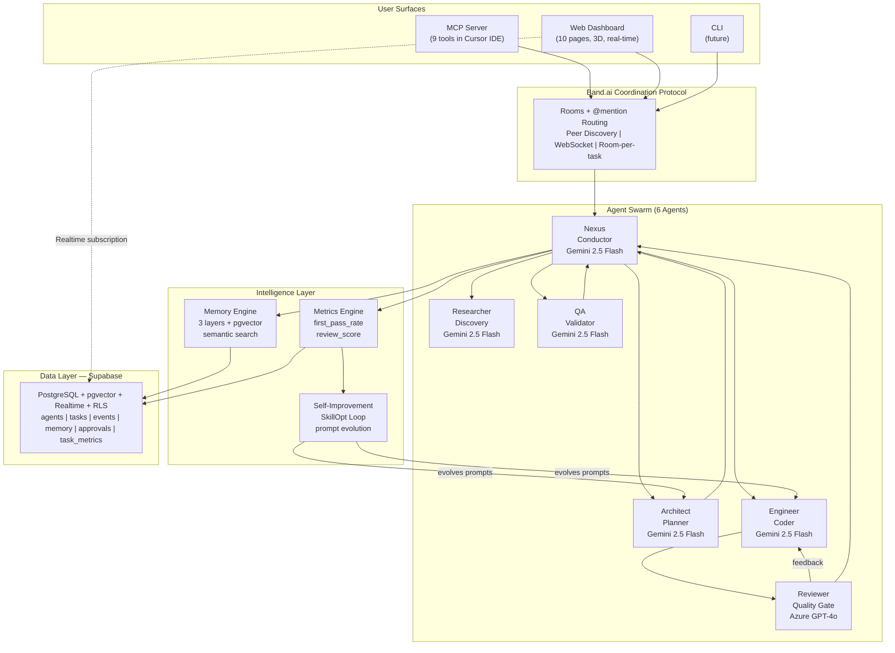
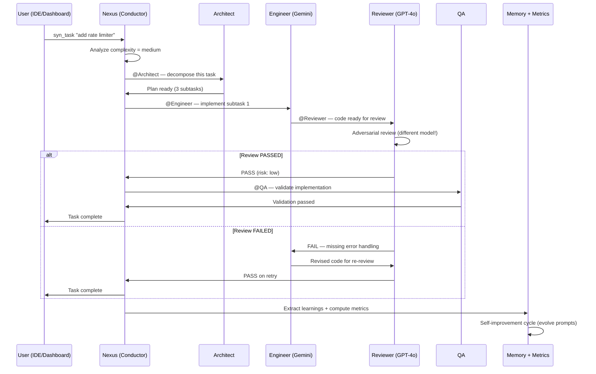
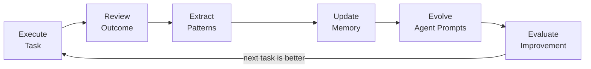
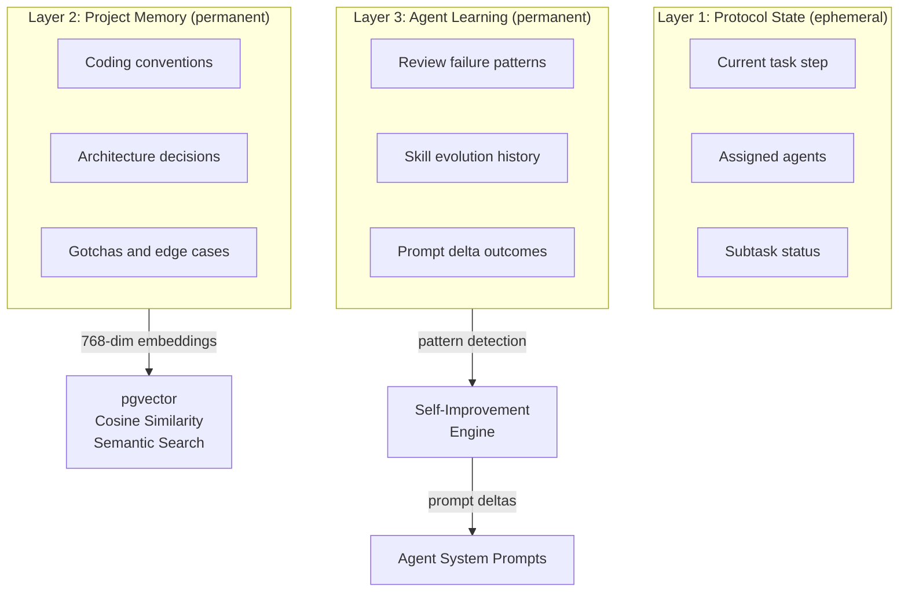
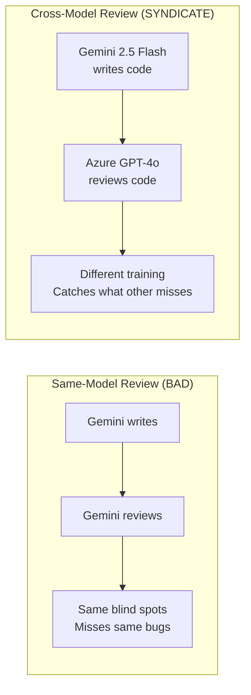
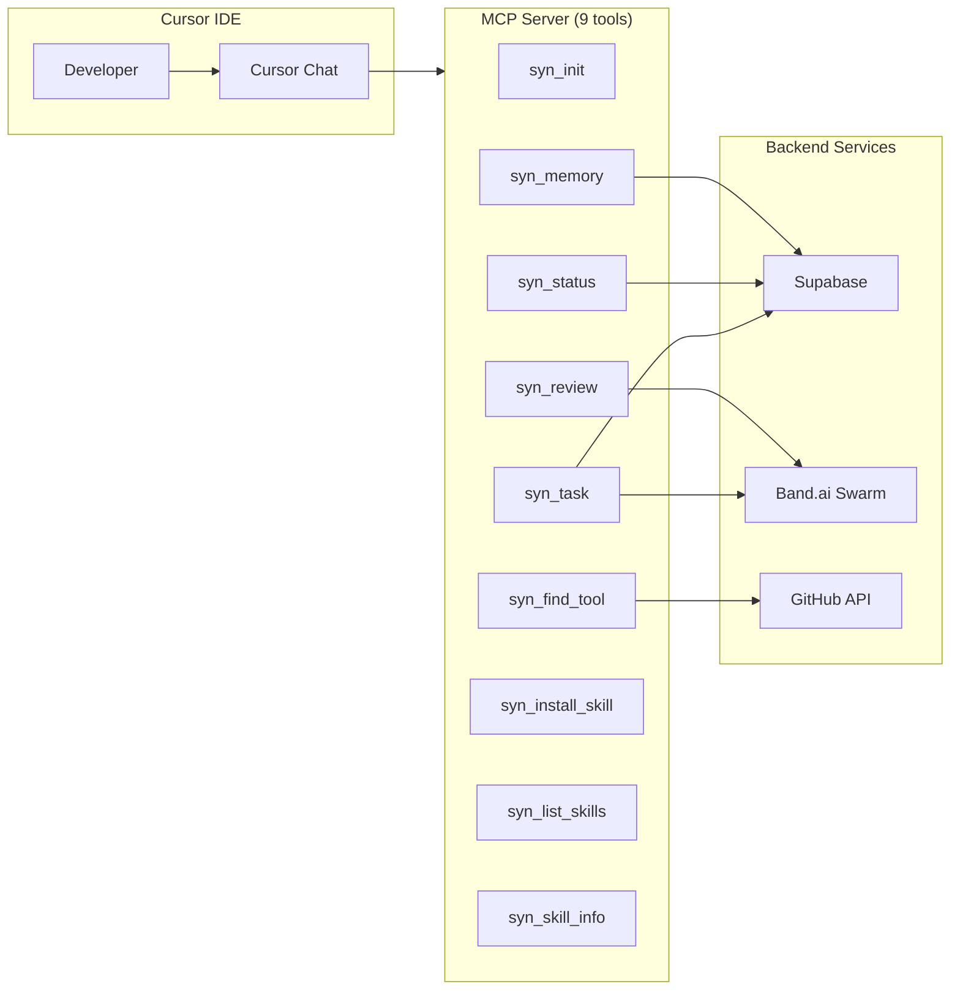
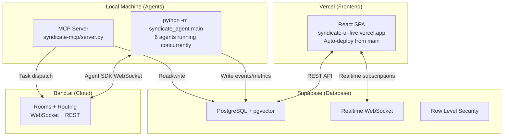
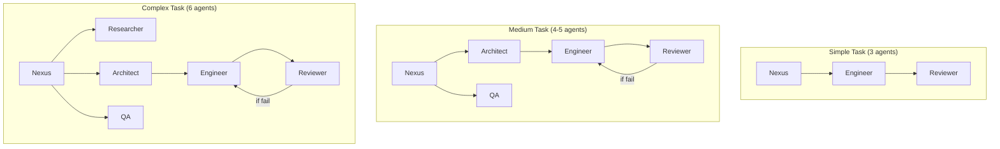

# Syndicate — System Architecture

> High-level architecture of the Syndicate multi-agent orchestration platform.
> A self-improving swarm that compounds intelligence across sessions.

---

## High-Level System Diagram

---

## Task Lifecycle (Sequence)

---

## Memory and Self-Improvement Flow

---

## Three Memory Layers

---

## Cross-Model Adversarial Review

---

## MCP Integration (IDE-Native Swarm)

---

## Deployment Architecture

---

## Dynamic Topology (Swarm Scales to Complexity)

---

## Core Principles

| # | Principle | Implementation |
|---|-----------|---------------|
| 1 | **Compound Intelligence** | Every task teaches the system. Memory persists. Skills evolve. Session 100 is 10x better than session 1. |
| 2 | **Visible Collaboration** | Agent-to-agent work is not hidden. Real-time dashboard shows who did what, why, and how handoffs happened. |
| 3 | **Cross-Model Adversarial** | The model that writes (Gemini) is never the model that reviews (GPT-4o). Different families catch different blind spots. |
| 4 | **Dynamic Topology** | Agent count scales with complexity. Simple = 3 agents. Complex = 6 agents. The swarm breathes. |
| 5 | **Human-in-the-Loop** | High-risk decisions escalate to humans. The system asks, not assumes. |
| 6 | **Self-Improvement Loop** | After every cycle: extract lessons, update memory, refine prompts. Next cycle is measurably better. |

---

## Agent Roster (Detailed)

### Nexus — Conductor
- **Model**: Gemini 2.5 Flash
- **Role**: Receives all incoming tasks. Analyzes complexity. Dynamically recruits agents. Tracks protocol state. Reports completion.
- **Band tools**: `band_lookup_peers`, `band_add_participant`, `band_send_message`, `band_create_chatroom`
- **Key behavior**: Routes work to specialists. Never implements. Goes silent after dispatching.

### Architect — Planner
- **Model**: Gemini 2.5 Flash
- **Role**: Decomposes tasks into structured subtasks with dependencies. Identifies risks. Defines success criteria.
- **Output**: Numbered subtasks with descriptions, dependencies, estimated complexity.
- **Key behavior**: Amplifies intent before planning. Identifies edge cases proactively.

### Engineer — Coder
- **Model**: Gemini 2.5 Flash
- **Role**: Implements code. Follows project conventions from memory. Handles one subtask at a time.
- **Key behavior**: Checks memory before implementing. Applies learned patterns. Produces typed code with error handling.
- **Evolving**: Self-improvement engine modifies this agent's prompt based on review outcomes.

### Reviewer — Quality Gate
- **Model**: Azure OpenAI GPT-4o (DIFFERENT model family)
- **Role**: Adversarial code review. Catches bugs, missing error handling, security issues.
- **Output**: Structured verdict — PASS/FAIL with findings and severity.
- **Why different model**: Same-model review shares blind spots. Cross-model provides genuine adversarial perspective.

### Researcher — Discovery
- **Model**: Gemini 2.5 Flash
- **Role**: Web research, documentation lookup, tool discovery, prior art.
- **Spawning**: Only recruited for complex tasks or knowledge gaps.

### QA — Validator
- **Model**: Gemini 2.5 Flash
- **Role**: Testing and verification. Validates implementation meets requirements.
- **Spawning**: Recruited for medium+ complexity tasks.

---

## MCP Server — 9 Tools

| Tool | Purpose | Connects To |
|------|---------|-------------|
| `syn_init` | Initialize swarm for project | Supabase (agent count, skills, memory) |
| `syn_task` | Submit task to swarm | Supabase tasks + Band |
| `syn_status` | Check agents, tasks, approvals | Supabase |
| `syn_review` | Request cross-model code review | GPT-4o reviewer queue |
| `syn_memory` (query) | Search accumulated knowledge | Supabase + pgvector |
| `syn_memory` (store) | Teach system a convention | Supabase memory |
| `syn_find_tool` | Search for skills/tools | GitHub API |
| `syn_install_skill` | Install from GitHub | npx skills + filesystem |
| `syn_list_skills` | Show installed skills | Local directories |

**Protocol**: JSON-RPC 2.0 over stdio (MCP standard)
**Config**: `.cursor/mcp.json` — one entry, auto-discovered by Cursor

---

## Frontend — 10 Pages

| Page | Function | Data Source |
|------|----------|-------------|
| Landing `/` | Cinematic 3D intro + CTA | Static + GSAP ScrollTrigger |
| Dashboard `/app` | Task submission, swarm status | Supabase Realtime |
| Pipeline `/pipeline` | Signal flow (expandable stages) | Supabase events |
| Live Room `/live` | Real-time agent event stream | Supabase Realtime |
| Agents `/agents` | Roster with models and status | Supabase agents |
| Tasks `/tasks` | Kanban pipeline | Supabase tasks |
| Metrics `/metrics` | KPIs + improvement trend | Supabase task_metrics |
| Memory `/memory` | Store/query learnings | Supabase memory + RPC |
| Approvals `/approvals` | Human-in-the-loop decisions | Supabase approvals |
| Settings `/settings` | Theme, sound, preferences | Local state |

**Design**: Dark-mode (#08090a), one accent (indigo #6366f1), glassmorphic, Three.js 3D, Framer Motion + GSAP, Web Audio API sound design.

---

## Data Layer — Supabase Tables

| Table | Purpose | Key Columns |
|-------|---------|-------------|
| `agents` | Swarm roster | name, role, status, model, description |
| `tasks` | Task pipeline | id, description, status, complexity, assigned_agents |
| `events` | Agent activity log | agent, type, content, task_id, created_at |
| `memory` | Compound intelligence | content, category, agent, tags, embedding(768) |
| `approvals` | HITL decisions | task_id, description, risk_level, status |
| `task_metrics` | Performance | task_id, first_pass_rate, iteration_count, time_to_complete |

**Features**: pgvector (semantic search), Realtime (WebSocket), RLS (anon reads), RPC (`match_memories`)

---

## Technology Stack

| Layer | Technology | Purpose |
|-------|-----------|---------|
| Coordination | Band.ai | Rooms, @mention routing, WebSocket, peer discovery |
| LLM Primary | Google Gemini 2.5 Flash | 5 agents (fast, free, powerful) |
| LLM Adversarial | Azure OpenAI GPT-4o | Reviewer (different model family) |
| Embeddings | Google text-embedding-004 | 768-dim vectors for semantic memory |
| Frontend | React 19 + Vite 8 + TypeScript 6 | SPA with real-time |
| Styling | Tailwind CSS v4 | Dark-mode-first |
| State | Zustand | Lightweight store |
| 3D | Three.js + React Three Fiber | Orb constellation, particles |
| Animation | Framer Motion + GSAP | Springs, scroll reveals |
| Sound | Web Audio API | Synthesized feedback |
| Auth | Clerk | GitHub + Google + Microsoft OAuth |
| Database | Supabase (PostgreSQL) | Relational + JSONB + Realtime |
| Vector | pgvector | Cosine similarity on embeddings |
| MCP | Python (stdio JSON-RPC) | 9 IDE tools |
| Agent SDK | Band SDK (Python) | Agent lifecycle + adapters |
| Deploy | Vercel + Supabase | Managed, auto-deploy |

---

## Differentiation

| Existing Tools | Syndicate |
|---------------|-----------|
| Stateless (forget between sessions) | 3-layer persistent memory compounds forever |
| Single model reviews its own work | Cross-model adversarial (Gemini vs GPT-4o) |
| Fixed agents (just prompts) | Dynamic topology — swarm scales to complexity |
| No visibility into AI work | Real-time dashboard shows every handoff |
| Never learns your codebase | Project memory stores conventions + gotchas |
| Same quality day 100 as day 1 | Self-improvement: quantified, measurable |
| Separate tools for plan/code/review | Unified lifecycle through Band rooms |
| CLI or web (not both) | MCP (IDE) + Dashboard (web) + CLI (future) |
